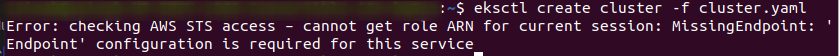
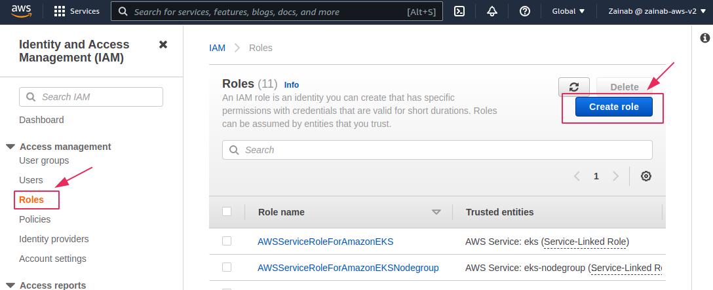
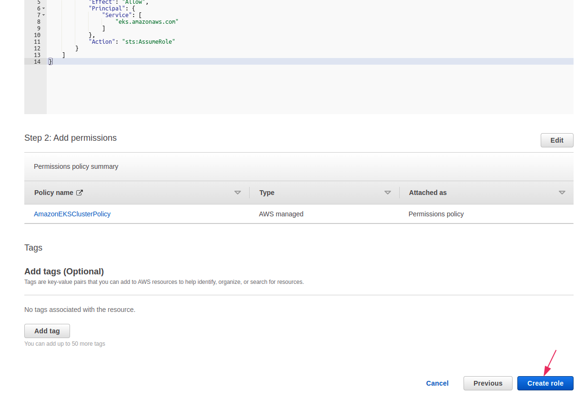
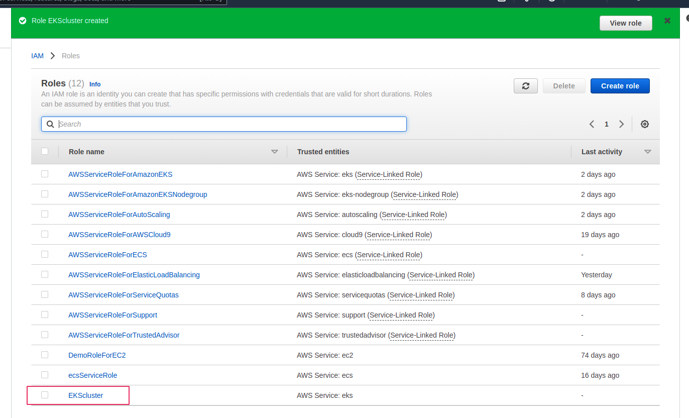
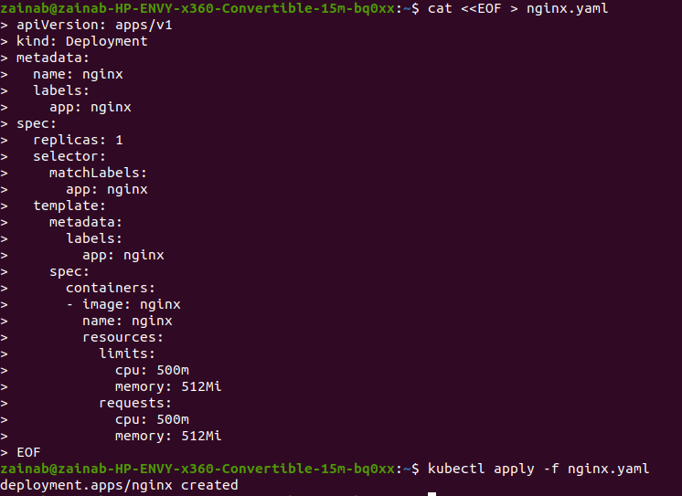

# Chaos Engineering with LitmusChaos on Amazon EKS

## What is Chaos engineering?

***“Chaos engineering is the discipline of experimenting on a distributed system in order to induce artificial failures to build confidence in the system’s capability to withstand turbulent conditions in production”***. 

It is an approach to software testing and quality assurance with the goal to identify weakness in a system through controlled experiments that introduce random and unpredictable behavior. It is well suited to modern distributed systems and processes.   

Although individual services in a distributed system may be functioning properly, the interaction between those services can cause unpredictable outcomes that may lead to real-world disruptive events. Identifying these disruptive events before they manifest will prevent downtime in production and build confidence in our deployment. 

**Problems a chaos experiment might uncover**:

* Blind spots - Places where monitoring software cannot gather adequate data.

* Hidden bugs -  Glitches or other issues that can cause software to malfunction.

* Performance bottlenecks - Situations where efficiency and performance could be improved.

**Benefit**:

* Identify vulnerabilities before a hacker does or before system failure.
* Increase confidence in an organization’s system.
* Improve a system’s resilience.
* Helps businesses prevent extremely large losses in revenue and maintenance costs. 

**There are typically four steps for the experiment**:

1. ***Set a baseline*** - You start by defining a steady state as some measurable output of the system that indicates normal behavior.

2. ***Create a hypothesis*** - Hypothesize that the steady state will continue in both the control group and the experimental group.

3. ***Test*** - Introduce variables that reflect real world events  such as simulating a failure.

4. ***Evaluate*** -  Measure and evaluate how the hypothesis holds up and determine the problem(s) to fix.

 
## What is LitmusChaos Architecture?

Litmus is an open source Chaos engineering platform that enables teams to identify weaknesses and potential outages in infrastructures by inducing chaos tests in a controlled way.  Using Litmus, you can create chaos experiments, find bugs fast and fix them before the production phase. 

Litmus takes a cloud-native approach to create, manage, and monitor chaos. Chaos is orchestrated using the following Kubernetes CRDs:

**ChaosEngine**: A resource to link a Kubernetes application or Kubernetes node to a ChaosExperiment. ChaosEngine is watched by the Litmus ChaosOperator, which then invokes ChaosExperiments

**ChaosExperiment**: A resource to group the configuration parameters of a chaos experiment. ChaosExperiment CRs are created by the operator when experiments are invoked by ChaosEngine.

**ChaosResult**: A resource to hold the results of a ChaosExperiment.

### Create EKS Cluster 

To get started, we will create an Amazon EKS cluster with managed nodes using `eksctl`. We will then install LitmusChaos and a demo application. 

**Kubernetes** also known as **k8s** is an open source system for automating deployment, scaling and management of containerized applications. The **Amazon Elastic Container Service for Kubernetes (EKS)** is a cloud based container management service that natively integrates with Kubernetes to deploy applications.  

A **kubernetes cluster** is a collection of  nodes that run containerized applications. Kubernetes clusters consist of one master node and a number of worker nodes. 

#### **Prerequisites**

You should have the AWS CLI version 2, `ekstcl` and `kubectl` installed before you get started with creating a cluster. 

***Note***: You can use the below links to install

Link to install ecstcl: https://docs.aws.amazon.com/eks/latest/userguide/eksctl.html

Link to install kubectl: https://kubernetes.io/docs/tasks/tools/install-kubectl-linux/

Once you have the prerequisites installed, run the following commands to start:

    $ export ACCOUNT_ID=$(aws sts get-caller-identity --output text --query Account)

Then: 

    $ export AWS_REGION=us-east-2 #change as per your region of choice

Now create a `yaml` file:

    $ touch cluster.yaml

Using `nano`, open the `cluster.yaml` file 

    $ sudo nano cluster.yaml

> 

Place the below code, then save and exit:

    --- 
    apiVersion: eksctl.io/v1alpha5 
    kind: ClusterConfig
    metadata: 
        name: eks-litmus-demo 
        region: ${AWS_REGION} 
        version: "1.21" 
    managedNodeGroups:
         - instanceType: m5.large 
           amiFamily: AmazonLinux2 
           name: eks-litmus-demo-ng 
           desiredCapacity: 2 
           minSize: 2 
           maxSize: 4

> 

To create the cluster, run:

    $ eksctl create cluster -f cluster.yaml

> 

If you get the above error, you can go to your amazon account to create the cluster.

### **Step 1**

**Creating an EKS role**

First we create an EKS role by login into AWS account and search for *IAM*. Select *IAM* to navigate to its console. 

> 

Navigate to **Role** on the left bar and select **Create role**.

> 

On the **Select trusted entity** page, select **AWS service** as trusted entity type and from the drop down under **use cases for other AWS services**, search for  **EKS**, select **EKS - Cluster** and then select **Next**. 

> 

On the **Add permissions** page, the `AmazonEKSClusterPolicy` is added by default. Leave the default and select **Next**. 

> 

On the **Name, review and create** page, give your role a **name** and you may add a description (optional). Scroll to the bottom of the page and select **Create role**. 

> 

> 

The page will refresh, and you will be navigated to all the Roles, where you will find the newly created role. 

> 

### **Step 2**

 **Creating EKS Node Group role**

You need to create an IAM role for Worker nodes. Navigate to the IAM console, select **Role** on the left navigation tab and select **Create role**. 

> 

On the **Select trusted entity** page, select **EC2** as the use case and then select **Next**.

> 

On the **Add permissions** page, search and select the 3 policies below for provisioning worker nodes from Amazon EC2:

***AmazonEKSWorkerNodePolicy***

***AmazonEKS_CNI_Policy***

***AmazonEC2ContainerRegistryReadOnly***

> 
> 

Select **Next**.

On the **Name, review and create** page, give your role a **name** and you may add a description (optional). Review and make sure all 3 policies are on the **Add permission** section, scroll to the bottom of the page and select **Create role**. 

> 

> 

> 

### **Step 3**
Start by searching for EKS in the search box then select **Elastic Kubernetes Service** from the options that pop up. 

> 

Select **Add cluster** and the select **create**.

> 

On the **Configure cluster** page, use the following:

**Name**  -  type the cluster name **eks-litmus-demo**. 

**Cluster Service Role** - select the EKS role create.

Leave the default setting for everything else and click **Next**.

> 

On the **Specify networking** page, choose your subnet. Three subnets is a good amount, leave everything else as default and click **Next**. 

> 

> 

Click **Next** on the **Configure logging** page and on the **Review and create** page, click **Create**. 

> 

> 

> 

It will take a few minutes for the cluster to be created.

Navigate to  **clusters** on the left bar under **Amazon EKS**.

Once your cluster is created, the status will be **Active**.

> 

### **Step 4**

**Adding NodeGroups**

Select the newly created cluster.

Select the **Configuration** tab, select **Compute** under **Cluster Configuration**.

> 

Select **Add Node Group**.

> 

On the **Configure Node Group** page, complete the following:

**Name** - eks-litmus-demo-ng.

**Node IAM Role** - Select created **EKSWorkerNodeRole**.

Leave everything else as default and select **Next**.

 >

> 

On the **Node Group compute configuration** page leave everything as it is except:

**AMI type** :  Amazon Linux 2(AL2_x86_64)

**Capacity type** : On-Demand

**Instance types** : m5.large

**Disk size** : 20

**Minimum size** : 2 

**Maximum size** : 4

**Desired size** : 2

> 

> 

On the **Specify networking** page, click **Next**.

> 

On the **Review and create** page,  click **Create**.

> 

Navigate back to your cluster and under the **Node Groups** section, you will see the node group you created and the status should be **Active**.

> 

## Install Helm

Helm is a package manager for kubernetes. The Helm charts help define, install and upgrade even the most complex Kubernetes application. 

To start the installation, run: 

    $ curl -sSL https://raw.githubusercontent.com/helm/helm/master/scripts/get-helm-3 | bash

> 

Verify your installation and confirm that you are using Helm version `v3.x.xxxx`: 

    $ helm version –short

> 

### Install LitmusChaos 

You will install the LitmusChaos on an AMazon EKS cluster using a Helm chart. The Chart will install the needed CRDs, service account configuration and ChaosCenter.

Add litmus helm repository using:

    $ helm repo add litmuschaos https://litmuschaos.github.io/litmus-helm/

The next step is to confirm you have the Litmus-related Helm charts:

    $ helm search repo litmuschaos

Output:

>

Create a namespace to install LitmusChaos:

    $ kubectl create ns litmus

> 

You need to link your local terminal to the created cluster before creating the namespace to avoid the above error. 

Connect EKS to the local terminal using AWS CLI. Navigate to the link below to learn how

> https://aws.amazon.com/premiumsupport/cle-center/eks-cluster-connection/

> 

Once connected, re-run: 

    $ kubectl create ns litmus

> 

By default, the Litmus Helm chart creates NodePort services. Let’s change the backend service type to `ClusterIP` and front-end service type to `LoadBalancer`, so we can access the Litmus ChaosCenter using a load balancer.

Run: 

    $ cat <<EOF > override-litmus.yaml

Insert the following:

    portal:
    server:
        service:
        type: ClusterIP
    frontend:
        service:
        type: LoadBalancer
    EOF

> 

Now run:

    $ helm install chaos litmuschaos/litmus --namespace=litmus -f override-litmus.yaml

Output:
> 

 To verify litmus is running:

    $ kubectl get pods -n litmus

Output:

> 

And also run:

    $ kubectl get svc -n litmus

> 

Next run:

    $ export LITMUS_FRONTEND_SERVICE=`kubectl get svc chaos-litmus-frontend-service -n litmus --output jsonpath='{.status.loadBalancer.ingress[0].hostname}:{.spec.ports[0].port}'`
Then:

    $ echo "Litmus ChaosCenter is available at http://$LITMUS_FRONTEND_SERVICE"

Output:

 > 

Using the URL from your `echo` output, access the Litmus ChaosCenter UI. Sign in using the default username *”admin”* and password *”litmus”*.

> 

You will be prompted to set a new password. You can set it or choose to skip.

> 

A successful login will display the welcome dashboard. Click on the **ChaosAgents** link on the left hand navigation bar.

> 

A **Chaos Agent** is an agent which will run in a Kubernetes cluster.

Confirm that Self-Agent is in Active status.

> 

Confirm the agent installation on your terminal:

    $ kubectl get pods -n litmus

Output:

> 

Verify that LitmusChaos CRDs are created:

    $ kubectl get crds | grep chaos

Output:

> 

Verify that LitmusChaos API resources are created:

    $ kubectl api-resources | grep chaos

Output:

> 

Now that we have LitmusChaos on the EKS cluster, it is time to install a demo application to perform some chaos experiments. 

### **Installing demo application**

First we need to deploy `nginx` on our cluster using the manifest below to run the chaos experiments on it. Create and save the manifest as `nginx.yaml`:

Run:

    cat <<EOF > nginx.yaml

Add the information:

    apiVersion: apps/v1
    kind: Deployment
    metadata:
    name: nginx
    labels:
        app: nginx
    spec:
    replicas: 1
    selector:
        matchLabels:
        app: nginx
    template:
        metadata:
        labels:
            app: nginx
        spec:
        containers:
        - image: nginx
            name: nginx
            resources:
            limits:
                cpu: 500m
                memory: 512Mi
            requests:
                cpu: 500m
                memory: 512Mi
    EOF

Apply it by:

    $ kubectl apply -f nginx.yaml

> 

Verify that nginx pod is running:

    $ kubectl get pods

> 

## **Chaos Experiments**

**Litmus ChaosHub** is a public repository where LitmusChaos community members publish their chaos experiments such as ***pod-delete***, ***node-drain***, ***node-cpu-hog***, etc. 

We will perform the **pod-autoscaler** experiment from LitmusChaos hub to test cluster auto scaling on Amazon EKS cluster. 

### **Experiment: Pod Autoscaler**

The intent of the pod auto scaler experiment is to check the ability of nodes to accommodate the number of replicas for a deployment. The experiment can also be used to check the cluster auto-scaling feature. 

**Hypothesis** : Amazon EKS cluster should auto scale when cluster capacity is insufficient to run the pods. 

The Chaos experiment can be launched in the Litmus Chaos Center UI. 

Once you log in, select **Litmus Workflows** in the left navigation bar and then select **Schedule a workflow** button to create a workflow. 

 > 

On the Schedule a new Litmus workflow page, select the **Self-Agent** radio button and then select **Next**.

> 

Select **Create a new workflow using the experiments from ChaosHubs** and leave the default **Litmus ChaosHub** from the dropdown and click **Next**.

> 

Enter a name for your workflow on the workflow settings page and select **Next**.

> 

Next we add the experiments by selecting **Add a new experiment**; then search for **autoscaler**,  select the **generic/pod-autoscaler** radio button and click **Done**.

> 

> 

To change some parameters on the experiment, select the **Edit** icon.

> 

Make the following changes and leave the default values for **General**, **Target Application** and **Define the steady state for this application** section by clicking **Next** after each section. In the **Tune Experiment** section:

**TOTAL_CHAOS _DURATION** - 180

**REPLICA_COUNT** - 10

***Note: Total chaos duration, sets the desired chaos duration in seconds and Replica count is the number of replicas to scale during the experiment***.

Select **Finish** and then **Next**.

> 

Leave the default for reliability score and schedule page, select **Next** for each page. On the verify and commit page, select **Finish**.

> 

A new litmus workflow has been successfully created. 

> 

The chaos experiment is now scheduled to run and you can look at the status by clicking on the workflow. 

> 

 From the ChaosResults, the experiment failed because there was no capacity to run 10 replicas.

> 

### **Install cluster Autoscaler** 

**Cluster Autoscaler** is a tool that automatically adjusts the size of the Kubernetes cluster based on the utilization of Pods and Nodes in your cluster. 

### **Step 1**

Create an **IAM OIDC** identity provider for your cluster with the following command:

    $ eksctl utils associate-iam-oidc-provider --cluster eks-litmus-demo --approve

> 

### **Step 2**

Create an IAM policy that grants permissions that the Cluster Autoscaler requires to use. 

Run:

    cat <<EOF > cluster-autoscaler-policy.json

Paste:

    { 
        "Version": "2012-10-17", 
        "Statement": [
            {
                 "Action": [
                "autoscaling:DescribeAutoScalingGroups", "autoscaling:DescribeAutoScalingInstances", "autoscaling:DescribeLaunchConfigurations", "autoscaling:DescribeTags", "autoscaling:SetDesiredCapacity", "autoscaling:TerminateInstanceInAutoScalingGroup", "ec2:DescribeLaunchTemplateVersions" 
                ], 
                "Resource": "*", 
                "Effect": "Allow" 
            } 
         ] 
    } 
    EOF

Run:

    $ aws iam create-policy \ 
      --policy-name AmazonEKSClusterAutoscalerPolicy \ 
      --policy-document file://cluster-autoscaler-policy.json

> 

Now create an IAM role and attach an IAM policy to it using `eksctl`:

    $ eksctl create iamserviceaccount \
        --cluster=eks-litmus-demo \
        --namespace=kube-system \
        --name=cluster-autoscaler \   
        --attach-policy-arn="arn:aws:iam::286396332837:policyAmazonEKSClusterAutoscalerPolicy" \
        --override-existing-serviceaccounts \
        --approve

> 

***Note: your policy arn can be found in your IAM console, when you click on the policy***.

> 

Make sure your service account with the ARN of the IAM role is annotated.

    $ kubectl describe sa cluster-autoscaler -n kube-system

> 

### **Deploying the Cluster Autoscaler** 

Download the cluster autoscaler manifest: 

    $ curl -o cluster-autoscaler-autodiscover.yaml https://raw.githubusercontent.com/kubernetes/autoscaler/master/cluster-autoscaler/cloudprovider/aws/examples/cluster-autoscaler-autodiscover.yaml

Using `nano`, edit the downloaded file to replace *\<YOUR CLUSTER>* with the cluster name **(eks-litmus-demo)** and add the following two lines.

- --balance-similar-node-groups
- --skip-nodes-with-system-pods=false

       $ sudo nano cluster-autoscaler-autodiscover.yaml

The edited section should look like this:

> 

Apply the manifest file to the cluster:

    $ kubectl apply -f cluster-autoscaler-autodiscover.yaml

> 

Patch the deployment to add the `cluster-autoscaler.kubernetes.io/safe-to-evict` annotation to the Cluster Autoscaler pods:

    $ kubectl patch deployment cluster-autoscaler \ 
    -n kube-system \ 
    -p '{"spec":{"template":{"metadata":{"annotations":{"cluster-autoscaler.kubernetes.io/safe-to-evict": "false"}}}}}'

> 

Run:

    $ export K8S_VERSION=$(kubectl version --short | grep 'Server Version:' | sed 's/[^0-9.]*\([0-9.]*\).*/\1/' | cut -d. -f1,2)

Then:

    $ export AUTOSCALER_VERSION=$(curl -s "https://api.github.com/repos/kubernetes/autoscaler/releases" | grep '"tag_name":' | grep -m1 ${K8S_VERSION} | sed 's/[^0-9.]*\([0-9.]*\).*/\1/')

Set the Cluster Autoscaler image tag to the version that was exported in the previous step with the following command:

    $ kubectl set image deployment cluster-autoscaler \
    -n kube-system \
    cluster-autoscaler=k8s.gcr.io/autoscaling/cluster-autoscaler:${AUTOSCALER_VERSION}

> 

View the Cluster Autoscaler logs and verify that it’s monitoring your cluster load:

    $ kubectl -n kube-system logs -f deployment.apps/cluster-autoscaler

> 

Now that we have deployed the Cluster Autoscaler, let’s rerun the same experiment by navigating to **Litmus Workflows**, then the **Schedules** tab. Select the ***three dots*** menu icon for the workflow and select **Rerun Schedule**.

> 

This time, the Cluster Autoscaler will add additional nodes to the cluster, and the experiment will pass, which proves our hypothesis.

> 

### **Experiment Conclusion**

Auto Scaling the pod triggered the ClusterAutoscaler as a result of insufficient capacity, a new node was added to the cluster and the pods were successfully provisioned.

### **Next Steps**

From the above walkthrough, we saw how to get started with Chaos Engineering using LitmusChaos on Amazon EKS cluster. There are additional experiments such as ***pod-delete***, ***node-drain***, ***node-cpu-hog***, and so on that you can integrate with a CI/CD pipeline to perform Chaos Engineering. LitmusChaos also supports ***gitops*** and advanced chaos workflows using ***Chaos Workflows***.

### **pod-delete**

Pod delete contains chaos to disrupt the state of kubernetes resources. Experiments can inject random pod delete failures against specified applications. The pod delete experiment:

Causes pod failure of random replicas of an application deployment 
Tests deployment sanity (replica availability & uninterrupted service) and recovery workflows of the application pod. 

#### **Prerequisite**

**Install Litmus Operator** - This is a tool for injecting Chaos Experiment 

### **Installation** 

Users looking to use Litmus for the first time have two options available to them today. One way is to use a hosted Litmus service like **ChaosNative Litmus Cloud**. Alternatively, users looking for some more flexibility can install Litmus into their own Kubernetes cluster.

* Self-Hosted

* Hosted (Beta)

Installation of Self-Hosted Litmus can be done using either of the below
methods :

**Helm3** chart

**Kubectl** yaml spec file.

We will be going through the Self-Hosted Litmus installation.

### **Installing Litmus using Helm**

The helm chart will install all the required service account configuration and ChaosCenter.
The following steps will help you install Litmus ChaosCenter via helm.

### **Step 1**

***Note***: The first couple of steps were completed earlier so it should not be repeated. Start from ***Install this Chaos Experiment*** if you have been following along from the beginning. 

Add the litmus helm repository:

    $  helm repo add litmuschaos https://litmuschaos.github.io/litmus-helm/

    $  helm repo list 

Output:

> 

### **Step 2** 

Create the litmus namespace.

The litmus chaoscenter components can be placed in any namespace, though it is usually placed in **”litmus”**

    $ kubectl create ns litmus

Install Litmus ChaosCenter:

    $ helm install chaos litmuschaos/litmus --namespace=litmus

### **Install this Chaos Experiment**

You can install the Chaos Experiment using the following command:

    $ kubectl apply -f https://hub.litmuschaos.io/api/chaos/2.6.0?file=charts/generic/pod-delete/experiment.yaml

> 

**Setup Service Account (RBAC)**

Create a service account using the following command:

    $ kubectl apply -f https://hub.litmuschaos.io/api/chaos/2.6.0?file=charts/generic/pod-delete/rbac.yaml

> 

### **Sample Chaos Engine**

Create an `engine.yaml` file using `nano`

    $ sudo nano engine.yaml 

Place the below code in the file:

    apiVersion: litmuschaos.io/v1alpha1 
    kind: ChaosEngine 
    metadata: 
        name: nginx-chaos 
        namespace: default 
        spec: 
            appinfo: 
                appns: 'default' 
                applabel: 'app=nginx' 
                appkind: 'deployment' 
            # It can be active/stop 
            engineState: 'active' 
            chaosServiceAccount: pod-delete-sa 
            experiments: 
                - name: pod-delete 
                spec: 
                    components: 
                        env: 
                            # set chaos duration (in sec) as desired 
                            - name: TOTAL_CHAOS_DURATION 
                            value: '30' 
                            
                            # set chaos interval (in sec) as desired 
                            - name: CHAOS_INTERVAL 
                            value: '10' 
                            
                            # pod failures without '--force' & default terminationGracePeriodSeconds 
                            - name: FORCE 
                            value: 'false' 
                            
                            ## percentage of total pods to target 
                            - name: PODS_AFFECTED_PERC 
                            value: ''

> 

Apply the yaml file:

    $ kubectl apply -f engine.yaml 

> 

### **Node-drain**

#### **Prerequisite**

**Install Litmus Operator** - a tool for injecting Chaos Experiments

### **Install this Chaos Experiment**

Install the Chaos experiment by running this command:

    $ kubectl apply -f https://hub.litmuschaos.io/api/chaos/2.6.0?file=charts/generic/node-drain/experiment.yaml

> 

**Setup Service Account (RBAC)**

    $ kubectl apply -f https://hub.litmuschaos.io/api/chaos/2.6.0?file=charts/generic/node-drain/rbac.yaml

> 

Using `nano` create a file called `generic.yaml`

    $ sudo nano generic.yaml 

Place this code in the file:

    apiVersion: litmuschaos.io/v1alpha1 
    kind: ChaosEngine 
    metadata: 
        name: nginx-chaos 
        namespace: default 
    spec: 
        # It can be active/stop 
        engineState: 'active' 
        #ex. values: ns1:name=percona,ns2:run=nginx 
        auxiliaryAppInfo: '' 
        chaosServiceAccount: node-drain-sa 
        experiments: 
            - name: node-drain 
            spec: 
                components: 
                # nodeSelector: 
                # # provide the node labels 
                # kubernetes.io/hostname: 'node02' 
                    env: 
                        - name: TOTAL_CHAOS_DURATION 
                        value: '60' 
                        
                        # enter the target node name 
                        - name: TARGET_NODE 
                        value: ''

> 

Now apply the yaml using:

    $ kubectl apply -f generic.yaml

> 

### **Node-cpu-hog**

The **Node-cpu-hog** experiment causes CPU resource exhaustion on the Kubernetes node. It aims to verify resilience of applications whose replicas may be evicted on account of nodes turning unschedulable due to lack of CPU resources. 

Experiments can inject a CPU spike on a node where the application pod is scheduled.
CPU hog on a particular node where the application deployment is available.
After the test, the recovery should be manual for the application pod and node in case they are not in an appropriate state.

#### **Prerequisite** 

**Install Litmus Operator** - a tool for injecting Chaos Experiments

Install this chaos experiment using:

    $ kubectl apply -f https://hub.litmuschaos.io/api/chaos/2.6.0?file=charts/generic/node-cpu-hog/experiment.yaml

> 

**Setup Service Account (RBAC)**

    $ kubectl apply -f https://hub.litmuschaos.io/api/chaos/2.6.0?file=charts/generic/node-cpu-hog/rbac.yaml

> 

Create a `node-cpu.yaml` using nano:

    $ sudo nano node-cpu.yaml

Place this code in the editor:

    apiVersion: litmuschaos.io/v1alpha1
    kind: ChaosEngine
    metadata:
    name: nginx-chaos
    namespace: default
    spec:
    # It can be active/stop
    engineState: 'active'
    #ex. values: ns1:name=percona,ns2:run=nginx 
    auxiliaryAppInfo: ''
    chaosServiceAccount: node-cpu-hog-sa
    experiments:
        - name: node-cpu-hog
        spec:
            components:
            env:
                # set chaos duration (in sec) as desired
                - name: TOTAL_CHAOS_DURATION
                value: '60'
                
                - name: NODE_CPU_CORE
                value: ''
                
                ## percentage of total nodes to target
                - name: NODES_AFFECTED_PERC
                value: ''

                # provide the comma separated target node names
                - name: TARGET_NODES
                value: ''

> 

Now apply the yaml using: 

    $ kubectl apply -f node-cpu.yaml

> 

## **Clean up**

To avoid charges on your AWS account for resources no longer in use, you need to delete them.

### **Delete Clusters and Node Group** 

Navigate to the Amazon EKS console. Under clusters, click on **eks-litmus-demo** .

> 

Click on the **Configuration** tab, and then click on the **Compute** tab. Select the node group **eks-litmus-demo-ng**

> 

The **Delete** button should be active once the group name is selected, click on it.

> 

To complete the deletion process, you will be asked to type the node group name. Type it and click **Delete**.

> 

> 

Once the node group is empty, click **Delete cluster** at the top of the page, to delete the cluster. 

> 

***CONGRATULATIONS!!! You have successfully created a cluster and carried out Chaos experiment on the cluster***. 
